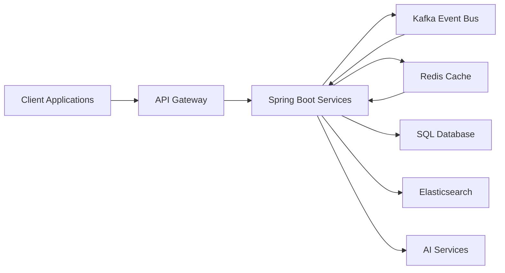

<!-- ======================================================= -->

<!--                     HERO SECTION                        -->

<!-- ======================================================= -->

<h1 align="center">Karan Kumar Singh</h1>

<h3 align="center">
Senior Backend Engineer • Distributed Systems • AI Systems Explorer
</h3>

---

# 🧬 Engineering DNA

<table>
<tr>

<td width="65%">

### Who I Am

I design backend systems that prioritize **scalability, reliability, and maintainability**.

My engineering focus is centered around **distributed systems**, **event-driven architectures**, and **high-performance backend services**, with a growing interest in integrating AI capabilities into production-grade software.

Rather than building isolated applications, I enjoy designing systems that communicate efficiently, recover gracefully from failures, and remain resilient under scale.

</td>

<td width="35%">

### Snapshot

🟢 4+ Years Experience

☕ Java Backend

⚡ Event-Driven Systems

🚀 Distributed Architecture

🧠 AI & Machine Learning

🎓 MS CS (AI/ML) Aspirant

</td>

</tr>
</table>

---

# 🧩 Technology Ecosystem

<table>

<tr>

<td align="center">

### Core

Java

Spring Boot

Spring Security

</td>

<td align="center">

### Messaging

Apache Kafka

Event Streaming

Async Processing

</td>

<td align="center">

### Performance

Redis

Caching

Low Latency

</td>

</tr>

<tr>

<td align="center">

### Persistence

SQL

DynamoDB

Elasticsearch

</td>

<td align="center">

### Infrastructure

Docker

Git

Maven

</td>

<td align="center">

### Next Frontier

🤖 LLMs

🧠 RAG

⚙ AI Agents

☁ Cloud Native

</td>

</tr>

</table>

---

# 🏗 System Architecture Blueprint

---

# 🎯 Core Competencies

<table>

<tr>

<td width="33%">

### ⚙ Backend Engineering

✔ Production APIs

✔ Secure Services

✔ Spring Boot

✔ REST Architecture

✔ Authentication

✔ Authorization

</td>

<td width="33%">

### 🌐 Distributed Systems

✔ Kafka

✔ Event Streaming

✔ Retry Strategy

✔ DLQ

✔ Scalability

✔ Fault Tolerance

</td>

<td width="33%">

### 🚀 Platform Engineering

✔ Redis

✔ Search

✔ SQL

✔ Elasticsearch

✔ Performance

✔ Optimization

</td>

</tr>

</table>

