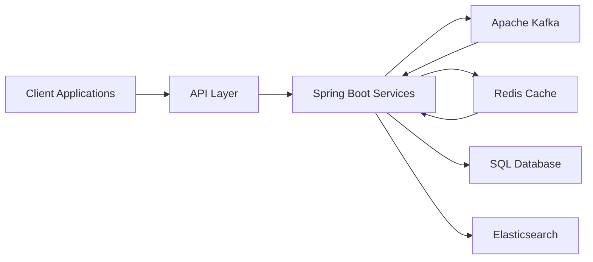

<!-- ========================================================= -->
<!--                    HERO SECTION                           -->
<!-- ========================================================= -->

<h1 align="center">Karan Kumar Singh</h1>

<h3 align="center">
Backend Engineer • Distributed Systems • Java • Spring Boot • Kafka • Redis
</h3>

---

# ⚡ Engineering Profile

<table>
<tr>

<td width="50%">

## 👨‍💻 Professional Summary

Backend Engineer with 4+ years of experience designing scalable backend services and distributed applications.

Experienced in building production-grade APIs, event-driven systems, caching strategies, and high-performance backend platforms.

Currently expanding into AI-powered systems while pursuing advanced knowledge in Machine Learning and Distributed AI.

</td>

<td width="50%">

## 🎯 Core Expertise

✔ Backend Engineering

✔ Distributed Systems

✔ Event Streaming

✔ REST APIs

✔ Microservices

✔ System Design

✔ Performance Optimization

✔ Scalable Architecture

</td>

</tr>
</table>

---

# 🛠 Tech Arsenal

<table>

<tr>

<td align="center">

### Backend

</td>

<td align="center">

### Messaging

</td>

<td align="center">

### Cache

</td>

</tr>

<tr>

<td align="center">

### Database

</td>

<td align="center">

### Cloud

</td>

<td align="center">

### Tools

</td>

</tr>

</table>

---

# 🏗 Architecture Blueprint

---
# ⚙️ Engineering Domains

<table>
<tr>

<td width="50%">

## Backend Engineering

✔ RESTful APIs

✔ Spring Boot Services

✔ Authentication & Authorization

✔ Microservice Architecture

✔ Production APIs

✔ Secure Backend Systems

</td>

<td width="50%">

## Distributed Systems

✔ Apache Kafka

✔ Event Streaming

✔ Asynchronous Processing

✔ Retry Mechanisms

✔ Fault Tolerance

✔ Horizontal Scalability

</td>

</tr>

<tr>

<td width="50%">

## Performance Engineering

✔ Redis Caching

✔ Session Management

✔ API Optimization

✔ Low Latency Design

✔ Database Optimization

✔ High Throughput Systems

</td>

<td width="50%">

## Search & Data Platforms

✔ Elasticsearch

✔ SQL Databases

✔ DynamoDB

✔ Indexing Strategies

✔ Query Optimization

✔ Data Retrieval

</td>

</tr>
</table>

---

---

# 🚀 Flagship Engineering Modules

<table>
<tr>

<td width="50%" valign="top">

## ⚡ Distributed Backend Platform

> Event-Driven Microservices Architecture

**Overview**

Designed scalable backend services following event-driven architecture principles with asynchronous messaging, distributed caching, and production-grade REST APIs.

**Tech**

`Java` `Spring Boot` `Kafka` `Redis` `SQL`

**Highlights**

* RESTful API Design
* Event-Driven Workflows
* Kafka Producers & Consumers
* Retry & Dead Letter Queue
* Redis Caching
* Horizontal Scalability

</td>

<td width="50%" valign="top">

## 🔐 Identity & Access Service

> Secure Authentication & Authorization Platform

**Overview**

Developed a centralized authentication and authorization service implementing role-based access control and secure API communication.

**Tech**

`Java` `Spring Boot` `Spring Security` `JWT`

**Highlights**

* JWT Authentication
* Role-Based Access Control (RBAC)
* Secure REST APIs
* User & Permission Management
* Token Validation
* Session Security

</td>

</tr>

<tr>

<td width="50%" valign="top">

## 🔍 Intelligent Search Platform

> High-Performance Search & Retrieval

**Overview**

Engineered a search platform capable of indexing, filtering, autocomplete, and optimized document retrieval using Elasticsearch.

**Tech**

`Java` `Spring Boot` `Elasticsearch`

**Highlights**

* Full-Text Search
* Inverted Index
* Query Optimization
* Autocomplete
* Reindex API
* Fast Data Retrieval

</td>

<td width="50%" valign="top">

## 🧠 AI Engineering Sandbox

> Exploring Intelligent Software Systems

**Overview**

A collection of experiments focused on integrating modern AI capabilities into software engineering workflows.

**Tech**

`Python` `LLMs` `RAG` `Machine Learning`

**Highlights**

* Retrieval-Augmented Generation
* AI Agents
* Prompt Engineering
* Intelligent Automation
* Model Evaluation
* Applied AI Prototypes

</td>

</tr>

</table>

---

# 🛰 Engineering Domains

<table>

<tr>

<td width="33%" valign="top">

## ☕ Backend Systems

* Java & Spring Boot
* REST API Development
* Spring Security
* JWT Authentication
* Clean Architecture
* Microservices

</td>

<td width="33%" valign="top">

## ⚡ Distributed Computing

* Apache Kafka
* Event Streaming
* Asynchronous Processing
* Retry & DLQ
* Fault Tolerance
* Scalability

</td>

<td width="33%" valign="top">

## 🚀 Performance Engineering

* Redis Caching
* Session Management
* Low-Latency APIs
* Database Optimization
* High Throughput
* Performance Tuning

</td>

</tr>

<tr>

<td width="33%" valign="top">

## 🗄 Data Platforms

* SQL
* DynamoDB
* Data Modeling
* Transactions
* Persistence Layer
* Query Optimization

</td>

<td width="33%" valign="top">

## 🔎 Search Engineering

* Elasticsearch
* Search APIs
* Inverted Index
* Reindex API
* Autocomplete
* Ranking Strategies

</td>

<td width="33%" valign="top">

## 🤖 AI Engineering

* Machine Learning
* Large Language Models
* RAG Systems
* AI Agents
* Prompt Engineering
* Intelligent Automation

</td>

</tr>

</table>

---

# 🧪 Engineering Lab

<table>
<tr>

<td width="50%" valign="top">

## 🔬 Currently Building

* Distributed Backend Systems
* Event-Driven Microservices
* AI-Enhanced Applications
* Production-Ready APIs
* Scalable Software Platforms

</td>

<td width="50%" valign="top">

## 📚 Currently Exploring

* AI Agents
* Cloud-Native Systems
* Distributed AI
* Vector Databases
* Retrieval-Augmented Generation
* Advanced System Design

</td>

</tr>
</table>

---

# 📊 GitHub Intelligence

---

# ⚙️ Engineering Principles

<table>

<tr>

<td align="center" width="25%">

### ⚡ Performance

</td>

<td align="center" width="25%">

### 🛡 Reliability

</td>

<td align="center" width="25%">

### 📈 Scalability

</td>

<td align="center" width="25%">

### 🔄 Fault Tolerance

</td>

</tr>

<tr>

<td align="center">

### 🔒 Security

</td>

<td align="center">

### 📡 Observability

</td>

<td align="center">

### 🧩 Maintainability

</td>

<td align="center">

### 🚀 Continuous Learning

</td>

</tr>

</table>

---

