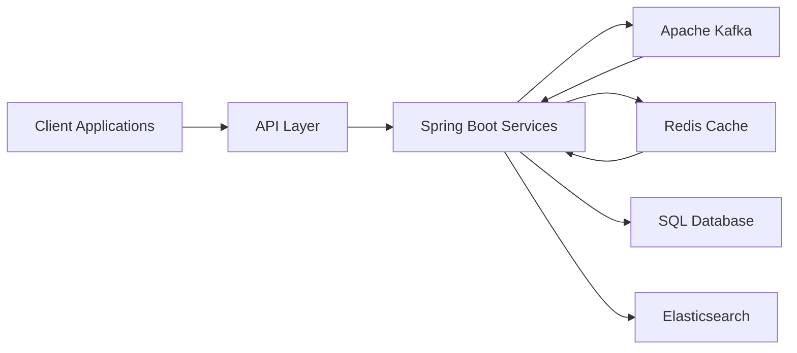

<!-- ========================================================= -->
<!--                    HERO SECTION                           -->
<!-- ========================================================= -->

<h1 align="center">Karan Kumar Singh</h1>

<h3 align="center">
Backend Engineer • Distributed Systems • Java • Spring Boot • Kafka • Redis
</h3>

---

# ⚡ Engineering Profile

<table>
<tr>

<td width="50%">

## 👨‍💻 Professional Summary

Backend Engineer with 4+ years of experience designing scalable backend services and distributed applications.

Experienced in building production-grade APIs, event-driven systems, caching strategies, and high-performance backend platforms.

Currently expanding into AI-powered systems while pursuing advanced knowledge in Machine Learning and Distributed AI.

</td>

<td width="50%">

## 🎯 Core Expertise

✔ Backend Engineering

✔ Distributed Systems

✔ Event Streaming

✔ REST APIs

✔ Microservices

✔ System Design

✔ Performance Optimization

✔ Scalable Architecture

</td>

</tr>
</table>

---

# 🛠 Tech Arsenal

<table>

<tr>

<td align="center">

### Backend

</td>

<td align="center">

### Messaging

</td>

<td align="center">

### Cache

</td>

</tr>

<tr>

<td align="center">

### Database

</td>

<td align="center">

### Cloud

</td>

<td align="center">

### Tools

</td>

</tr>

</table>

---

# 🏗 Architecture Blueprint

---
# ⚙️ Engineering Domains

<table>
<tr>

<td width="50%">

## Backend Engineering

✔ RESTful APIs

✔ Spring Boot Services

✔ Authentication & Authorization

✔ Microservice Architecture

✔ Production APIs

✔ Secure Backend Systems

</td>

<td width="50%">

## Distributed Systems

✔ Apache Kafka

✔ Event Streaming

✔ Asynchronous Processing

✔ Retry Mechanisms

✔ Fault Tolerance

✔ Horizontal Scalability

</td>

</tr>

<tr>

<td width="50%">

## Performance Engineering

✔ Redis Caching

✔ Session Management

✔ API Optimization

✔ Low Latency Design

✔ Database Optimization

✔ High Throughput Systems

</td>

<td width="50%">

## Search & Data Platforms

✔ Elasticsearch

✔ SQL Databases

✔ DynamoDB

✔ Indexing Strategies

✔ Query Optimization

✔ Data Retrieval

</td>

</tr>
</table>

