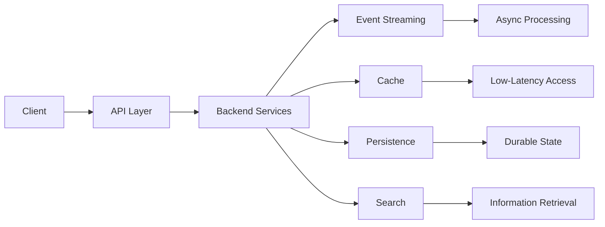

<div align="center">

# Karan Kumar Singh

### Backend Engineering · Distributed Systems · AI Security

**Building reliable backend systems and exploring the intersection of software engineering, program analysis, and AI.**

<br>

[](mailto:singh.3101karan@gmail.com)
[](https://www.linkedin.com/in/karankumarsingh)
[](https://github.com/Karansingh1999)
[](https://leetcode.com/u/Karan_1999/)

</div>

---

## 👨‍💻 About

I am a backend engineer focused on building **reliable, scalable, and maintainable software systems**.

My engineering interests span **Java backend development, distributed systems, event-driven architecture, APIs, caching, data persistence, and system design**. I am particularly interested in how systems behave under real-world constraints — concurrency, failures, latency, scale, and evolving requirements.

More recently, I have been exploring the intersection of **software engineering and AI security**, including static analysis, data-flow tracking, sensitive-data protection, and security controls for applications interacting with LLMs.

> I enjoy working on problems where **system design, reliability, performance, and security** matter as much as functionality.

---

## 🚀 Featured Engineering Work

### 🛡️ PIIFlow

**Policy-Aware Static Taint Analysis for LLM Data Security**

PIIFlow is a Python-based static analysis project for detecting potentially unsafe flows of sensitive information into LLM APIs.

It explores how traditional program-analysis techniques can be adapted to security challenges emerging in modern AI applications.

```text id="0ph9ik"
Sensitive Source
      │
      ▼
  Application
   Data Flow
      │
      ▼
Taint Propagation
      │
      ▼
 Policy Analysis
      │
      ▼
    LLM Sink
      │
      ▼
Security Finding
```

**Technical focus**

`Python` · `AST Analysis` · `Static Analysis` · `Taint Tracking` · `Data-Flow Analysis` · `LLM Security`

**Core question**

> Can sensitive-data exposure to LLMs be detected before the application ever runs?

[Explore PIIFlow →](https://github.com/Karansingh1999/PIIFlow)

---

## 💻 Selected Software Projects

<table>
<tr>
<td width="50%" valign="top">

### 🎵 Music App

**Android music application**

Java-based music application designed around albums, songs, playback, and personalized music consumption.

`Java` `Android`

[Explore repository →](https://github.com/Karansingh1999/Music-App)

</td>

<td width="50%" valign="top">

### 🗺️ Sharda Map

**Campus navigation application**

Android application designed to help students locate classrooms, laboratories, cafeterias, faculty offices, and other university locations.

`Java` `Android` `Firebase`

[Explore repository →](https://github.com/Karansingh1999/Sharda-Map)

</td>
</tr>

<tr>
<td width="50%" valign="top">

### 📰 News App

**News application with summarization**

Android application combining news consumption with text summarization for more concise information delivery.

`Java` `Android` `Text Summarization`

[Explore repository →](https://github.com/Karansingh1999/News-App)

</td>

<td width="50%" valign="top">

### 📱 COVID Tracking App

**API-driven Android application**

Application built around external data APIs for retrieving and presenting COVID-related information.

`Java` `Android` `REST APIs`

[Explore repository →](https://github.com/Karansingh1999/Covid-Android-App)

</td>
</tr>
</table>

---

## ⚙️ Engineering Stack

<table>
<tr>
<td width="23%"><b>Backend</b></td>
<td>Java · Spring Boot · REST APIs · Spring Security</td>
</tr>

<tr>
<td><b>Distributed Systems</b></td>
<td>Apache Kafka · Event-Driven Architecture · Asynchronous Processing</td>
</tr>

<tr>
<td><b>Data & Performance</b></td>
<td>SQL · Redis · Elasticsearch · DynamoDB · Caching</td>
</tr>

<tr>
<td><b>AI & Security</b></td>
<td>Python · Static Analysis · Taint Analysis · LLM Security · Data-Flow Analysis</td>
</tr>

<tr>
<td><b>Engineering</b></td>
<td>Docker · Git · GitHub · Maven · API Design</td>
</tr>
</table>

<br>

<p align="center">
  
</p>

---

## 🧠 Engineering Interests

<table>
<tr>
<td width="33%" valign="top">

### ⚡ Distributed Systems

Event-driven architectures, asynchronous communication, fault tolerance, scalability, and the behavior of services under failure.

</td>

<td width="33%" valign="top">

### 🛡️ Software & AI Security

Static analysis, sensitive-data flows, application security, and safeguards for software integrating with AI systems.

</td>

<td width="33%" valign="top">

### 🔍 Backend Performance

Caching, database access, search, latency reduction, resource efficiency, and designing systems that remain responsive under load.

</td>
</tr>
</table>

---

## 🏗️ Systems I Like Thinking About


```mermaid id="w1z4k9"
flowchart LR
    A["Client"] --> B["API Layer"]
    B --> C["Backend Services"]

    C --> D["Event Streaming"]
    C --> E["Cache"]
    C --> F["Persistence"]
    C --> G["Search"]

    D --> H["Async Processing"]
    E --> I["Low-Latency Access"]
    F --> J["Durable State"]
    G --> K["Information Retrieval"]
```

The technology matters, but the engineering questions matter more:

`What happens when a dependency fails?`

`Can the operation safely be retried?`

`Where should state live?`

`What should be synchronous vs. asynchronous?`

`How does the system behave as traffic increases?`

`Where are the security boundaries?`

---

## 🔬 Current Technical Direction

`Distributed Systems` · `Event-Driven Architecture` · `Backend Performance` · `Static Analysis` · `AI Security` · `LLM Systems`

I am increasingly interested in the boundary between **traditional backend engineering and emerging AI systems** — particularly how existing ideas from distributed systems, security, observability, and program analysis can make AI-enabled applications more reliable.

---

## 📊 GitHub Activity

<p align="center">
  
</p>

---

<div align="center">

### Backend Engineering · Distributed Systems · AI Security

**Reliable systems. Clear abstractions. Thoughtful engineering.**

<br>

[LinkedIn](https://www.linkedin.com/in/karankumarsingh) ·
[Email](mailto:singh.3101karan@gmail.com) ·
[GitHub](https://github.com/Karansingh1999) ·
[LeetCode](https://leetcode.com/u/Karan_1999/)

</div>
